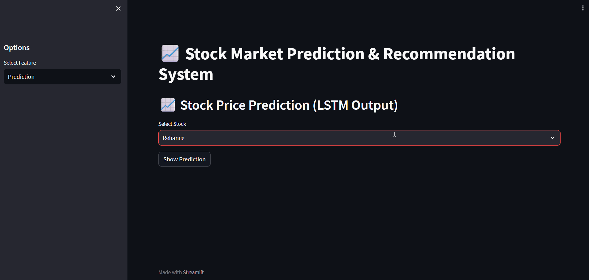
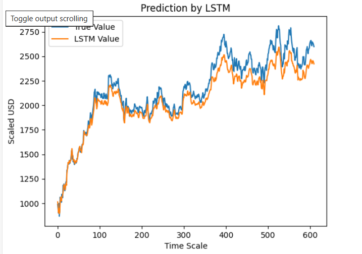
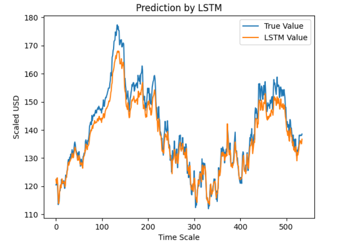
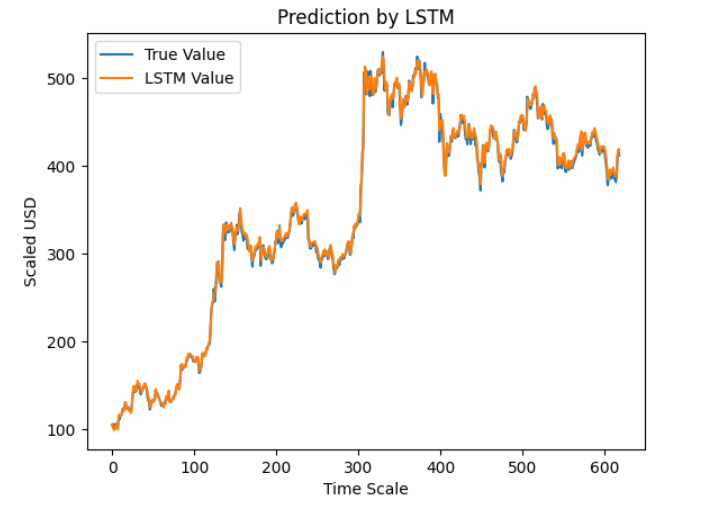
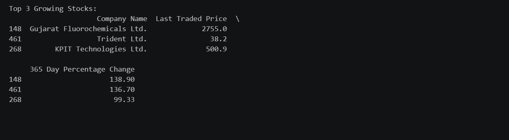
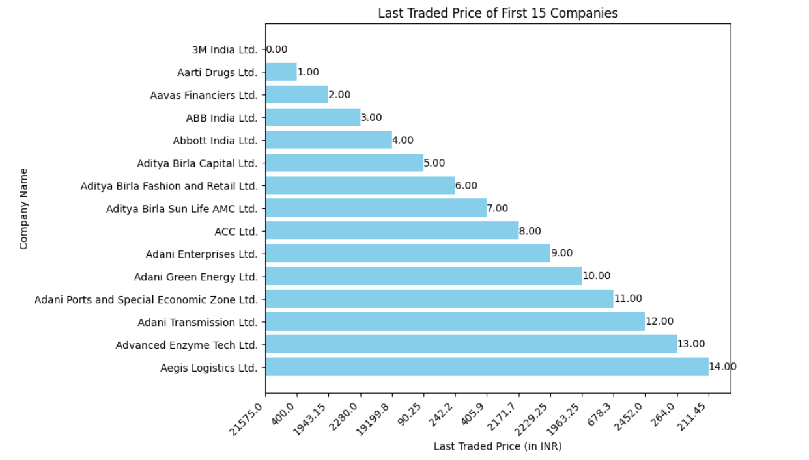

# 📈 Stock Market Price Prediction & Recommendation System

## 🎥 Demo Preview



> Quick preview of the interactive Streamlit interface for stock prediction and recommendation.


> ⚠️ This is an academic machine learning project and not intended for real-world trading decisions.

## 🔍 Overview

This project is a **multi-stock analysis system** designed to predict stock price trends and generate basic investment insights using machine learning techniques.

It combines:

* **LSTM-based time series forecasting** for stock price prediction
* **Cross-sector stock comparison**
* **Recommendation logic** based on similarity and growth trends

The system analyzes stocks from different sectors:

* Reliance (Telecom)
* Tata Motors (Automobile)
* Meta (Media/Technology)

---

## 🎯 Objectives

* Predict future stock price trends using historical data
* Compare stock performance across industries
* Provide basic recommendations based on growth and similarity

---

## ⚙️ Tech Stack

| Category      | Tools / Libraries  |
| ------------- | ------------------ |
| Language      | Python             |
| ML Framework  | TensorFlow / Keras |
| Data Handling | Pandas, NumPy      |
| Visualization | Matplotlib         |
| Preprocessing | Scikit-learn       |
| Environment   | Jupyter Notebook   |

---

## 🧠 System Architecture

### 1. Stock Price Prediction (LSTM)

* Uses historical stock data (Open, High, Low, Volume)
* Target variable: **Adjusted Close Price**
* Data scaling using MinMaxScaler
* TimeSeriesSplit for training/testing
* LSTM model for sequential learning

---

## 🔄 Workflow

1. Data is collected from historical stock datasets (Kaggle)
2. Data preprocessing:

   * Handling missing values
   * Feature selection (Open, High, Low, Volume)
   * Normalization using MinMaxScaler
3. LSTM model is trained to predict stock prices
4. Predictions are compared with actual values
5. Recommendation system:

   * Similarity model suggests related companies
   * Growth model identifies top-performing stocks

## 📘 Case Study

### 🧩 Problem Statement

Stock market prediction is complex due to volatility and multiple influencing factors.
The goal of this project was to build a system that can:

* Predict stock price trends
* Compare stocks across sectors
* Provide basic recommendation insights

---

### ⚙️ Approach

1. **Data Collection**

   * Historical stock data sourced from Kaggle

2. **Data Preprocessing**

   * Missing value handling
   * Feature selection (Open, High, Low, Volume)
   * Normalization using MinMaxScaler

3. **Modeling**

   * LSTM neural network used for time-series forecasting
   * Sequential learning to capture temporal dependencies

4. **Recommendation System**

   * Similarity-based model using TF-IDF
   * Growth-based model using percentage change

---

### 📊 Results

* LSTM model successfully captured general price trends
* Growth-based recommendation identified top-performing stocks effectively
* Similarity model provided basic company comparisons

---

### ⚠️ Key Learnings

* LSTM works well for trend prediction but needs proper tuning
* Financial recommendations require domain-specific indicators
* Simple models (like growth ranking) can outperform complex ones in practicality

---

### 🚧 Challenges Faced

* Lack of real-time data integration
* Limited financial feature engineering
* Model evaluation metrics not implemented

---

### 🔮 Future Scope

* Integrate real-time stock APIs
* Add technical indicators (RSI, MACD)
* Improve recommendation logic using financial metrics
* Build an interactive dashboard

---


### 2. Recommendation System (Two Approaches)

#### 📌 A. Similarity-Based Recommendation

* Uses **TF-IDF Vectorization**
* Combines:

  * Company Name
  * Industry
  * Price
  * Percentage Change
* Computes similarity using cosine similarity

👉 Note: This is a **content-based similarity approach**, not financial modeling.

---

#### 📌 B. Growth-Based Recommendation

* Based on **365-Day Percentage Change**
* Identifies **top-performing stocks**
* Simple but effective ranking logic

---

## 📊 Features

* 📈 LSTM-based stock price prediction
* 🔄 Multi-stock comparison across sectors
* 📊 Visualization of predicted vs actual prices
* 🧾 Content-based stock similarity analysis
* 🚀 Top-performing stock identification
* 📉 Data preprocessing and normalization
* 🌐 Interactive Streamlit-based demo interface   

---

## 📸 Results & Visualizations

### 📈 LSTM Stock Price Prediction

**Reliance**


**Meta**


**Tata Motors**


The model predicts stock trends based on historical data using LSTM. The graph compares actual vs predicted prices.

---

### 🚀 Growth-Based Recommendation



Top-performing stocks are identified using 365-day percentage growth.

---

### 🔍 Similarity-Based Recommendation



Content-based similarity is used to recommend companies with similar attributes.

---

## 🌐 Interactive Demo (Streamlit)

A lightweight web interface is provided using Streamlit to make the project interactive and easy to explore.

### 💡 Features of the Demo

* Select different stocks (Reliance, Tata Motors, Meta)
* View LSTM prediction results visually
* Explore recommendation outputs (growth & similarity)

### ▶️ Run the Demo

```bash
streamlit run app.py
```

This transforms the project from a notebook-based analysis into an interactive application.


## 📁 Project Structure

```
Stock-Market-Price-Prediction/
│
├── LSTM_Prediction/
│   ├── reliance_model.ipynb
│   ├── tatamotors_model.ipynb
│   ├── meta_model.ipynb
│
├── Recommendation_System/
│   ├── similarity_model.ipynb
│   ├── growth_model.ipynb
│
├── datasets/
│   ├── reliance.xlsx
│   ├── tatamotors.xlsx
│   ├── meta.xlsx
│   ├── recommendation.xlsx
│
├── README.md
├── CONTRIBUTING.md
├── LICENSE
├── requirements.txt
├── app.py
```

---

## ▶️ How to Run

### 1. Clone the repository

```bash
git clone https://github.com/krishtech11/Stock-Market-Price-Prediction-and-Recommendation-System.git
cd Stock-Market-Price-Prediction-and-Recommendation-System
```

---

### 2. Create Virtual Environment (Recommended)

```bash
python -m venv venv
```

Activate:

**Windows**

```bash
venv\Scripts\activate
```

---

### 3. Upgrade pip

```bash
python -m pip install --upgrade pip
```

---

### 4. Install Dependencies

```bash
pip install -r requirements.txt
```

---

### 5. Run Jupyter Notebooks

```bash
jupyter notebook
```

---

### 6. Run Streamlit Demo (Optional)

```bash
streamlit run app.py
```
> ⚠️ It is recommended to use a virtual environment to avoid dependency conflicts.

## 📉 Limitations

* ❌ No real-time stock data integration
* ❌ No proper financial indicators (RSI, MACD, etc.)
* ❌ No evaluation metrics (RMSE, MAE)
* ❌ TF-IDF similarity is not financially robust
* ❌ Not suitable for real trading decisions

---

## 🔮 Future Improvements

* Integrate real-time APIs (Yahoo Finance, Alpha Vantage)
* Add technical indicators (RSI, MACD)
* Implement proper evaluation metrics
* Build a web dashboard (Flask/React)
* Improve recommendation logic using financial signals

---

## 📄 Research Publication

This project is also published as a research paper:

**Title:** *Predicting Stock Market Prices and Provide Recommendations*
**Journal:** International Journal of Computer Information Systems and Industrial Management Applications

🔗 Read Paper: https://cspub-ijcisim.org/index.php/ijcisim/article/view/709

📌 The paper discusses:

* LSTM-based stock prediction approach
* Recommendation system design
* Comparative analysis across sectors


## 📌 Disclaimer

This project is for **educational purposes only** and should not be used for actual financial investment decisions.

---

## 👤 Author

**Krishna Arora**
- 🚀 Final Year BTech IT Student | Backend + AI Systems
- 💡 Focus: Distributed Systems, Automation, AI Integration
- GitHub: [@krishtech11](https://github.com/krishtech11)
- LinkedIn: [Krishna Arora](https://linkedin.com/in/krishna-arora-83b87a26b/)
- Email: krishnaarora747@gmail.com

---
